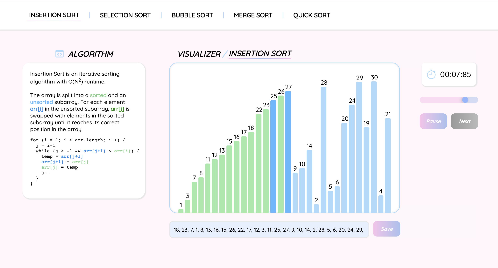

# Sorting Algorithm Visualizer 

A sorting algorithm visualizer built with ReactJS and CSS. Visualizes 5 of the most popular sorting algorithms (Insertion, Selection, Bubble, Merge, and Quick). Includes custom input, timer, speed adjustor, play/pause, and next button. See it in action [here](https://sort-algo-visual.netlify.app/). 

## Setting up in your local macine 

* Clone the repository: `git clone https://github.com/vc1530/sorting-algorithm-visualizer.git`

* Cd into the repository: `cd sorting-algorithm-visualizer`

* Install all dependencies: `npm install` 

* Start the project on localhost:3000: `npm start` 
